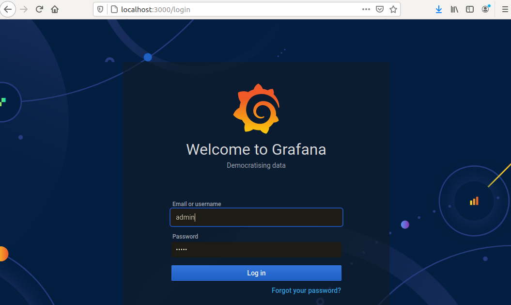

# Prerequisites
1. golang installed - https://golang.org/
2. Docker Installed - https://docs.docker.com/engine/install/ubuntu/

# Setup of Harmony Node
1. Verification of golang Installed
```
user@ubuntu:~$ export PATH=$PATH:/usr/local/go/bin
user@ubuntu:~$ go version
go version go1.16.3 linux/amd64
```
2. Verification of Docker Installed
```
user@ubuntu:~$ docker version
Client: Docker Engine - Community
 Version:           20.10.5
 API version:       1.41
 Go version:        go1.13.15
 Git commit:        55c4c88
 Built:             Tue Mar  2 20:18:05 2021
 OS/Arch:           linux/amd64
 Context:           default
 Experimental:      true
```
3. Compile the Harmony Node for docker
```
user@ubuntu:~$ cd $(go env GOPATH)/src/github.com/harmony-one/harmony
user@ubuntu:~$ make clean
user@ubuntu:~$ docker build -t harmony .
```

4. Start the Docker Container  
Make sure to open the correct ports if you are using a vps. You will need to open port 9900 like I did on the docker container.
```
user@ubuntu:~$ docker rm harmony # Remove old docker container
user@ubuntu:~$ docker run --name harmony -it -p "9900:9900" -v "$(go env GOPATH)/src/github.com/harmony-one/harmony:/root/go/src/github.com/harmony-one/harmony" harmony /bin/bash

root@b31643c962bb:~/go/src/github.com/harmony-one/harmony#
```

5. Start the Harmony Node
```
root@b31643c962bb:~/go/src/github.com/harmony-one/harmony# make debug
.
.
Started Explorer server at: 0.0.0.0:5099
Started RPC server at: 127.0.0.1:9599
Started WS server at: 127.0.0.1:9899
Started Rosetta server at: 127.0.0.1:9799
Started Explorer server at: 0.0.0.0:5098
Started RPC server at: 127.0.0.1:9598
Started WS server at: 127.0.0.1:9898
Started Rosetta server at: 127.0.0.1:9798
Started RPC server at: 127.0.0.1:9600
Started RPC server at: 127.0.0.1:9500
Started WS server at: 127.0.0.1:9800
```

6. Curl to check if harmony node is running correctly
```
user@ubuntu:~$ curl localhost:9900/metrics | grep ^hmy
.
.
.
hmy_stream_setup_stream_duration_bucket{topic="harmony/sync/localnet/0/1.0.0",le="0.32"} 783
hmy_stream_setup_stream_duration_bucket{topic="harmony/sync/localnet/0/1.0.0",le="0.64"} 783
hmy_stream_setup_stream_duration_bucket{topic="harmony/sync/localnet/0/1.0.0",le="1.28"} 783
hmy_stream_setup_stream_duration_bucket{topic="harmony/sync/localnet/0/1.0.0",le="2.56"} 783
hmy_stream_setup_stream_duration_bucket{topic="harmony/sync/localnet/0/1.0.0",le="+Inf"} 783
hmy_stream_setup_stream_duration_sum{topic="harmony/sync/localnet/0/1.0.0"} 1.2891841450000003
hmy_stream_setup_stream_duration_count{topic="harmony/sync/localnet/0/1.0.0"} 783
```

# Setup of Prometheus
1. Download and Unzip Prometheus from https://prometheus.io/download/
```
user@ubuntu:~/Downloads$ tar -xvzf prometheus-2.11.1.linux-amd64.tar.gz
```

2. Change Configuration Settings for Prometheus.
For me, my harmony node is running on "192.168.106.143"
Change your settings to fit what you need.
```
# my global config
global:
  scrape_interval:     15s # Set the scrape interval to every 15 seconds. Default is every 1 minute.
  evaluation_interval: 15s # Evaluate rules every 15 seconds. The default is every 1 minute.
  # scrape_timeout is set to the global default (10s).

# Alertmanager configuration
alerting:
  alertmanagers:
  - static_configs:
    - targets:
      # - alertmanager:9093

# Load rules once and periodically evaluate them according to the global 'evaluation_interval'.
rule_files:
  # - "first_rules.yml"
  # - "second_rules.yml"

# A scrape configuration containing exactly one endpoint to scrape:
# Here it's Prometheus itself.
scrape_configs:
  # The job name is added as a label `job=<job_name>` to any timeseries scraped from this config.
  - job_name: 'prometheus'

    # metrics_path defaults to '/metrics'
    # scheme defaults to 'http'.

    static_configs:
    - targets: ['192.168.106.143:9900']

```

Run it
```
user@ubuntu:~/Downloads/prometheus-2.26.0.linux-amd64$ ./prometheus
```


3. Test that the Prometheus site is working
```
Visit http://192.168.106.144:9090 -> Remember that you need to use your own prometheus server ip  
You can enter up in the execute as shown in the picture below
```


## Installing Prometheus As A Service
1. Create a file
```
sudo vi /etc/systemd/system/prometheus.service
```

2. Paste the following code
```
[Unit]
Description=Prometheus Server
Documentation=https://prometheus.io/docs/introduction/overview/
After=network-online.target

[Service]
User=root
Restart=on-failure

#Change this line if you download the 
#Prometheus on different path user

ExecStart=~/Downloads/prometheus-2.26.0.linux-amd64/prometheus

[Install]
WantedBy=multi-user.target
```

3. Run the following Commands
```
user@ubuntu:~$ sudo systemctl daemon-reload
user@ubuntu:~$ sudo chmod 755 /etc/systemd/system/prometheus.service
user@ubuntu:~$ sudo systemctl enable prometheus
user@ubuntu:~$ sudo systemctl start prometheus
```

4. Check the status
```
user@ubuntu:~$ sudo systemctl status prometheus
```

# Setup of Grafana
1. Download - https://grafana.com/grafana/download  
```
user@ubuntu:~$ sudo apt-get install -y adduser libfontconfig1
user@ubuntu:~$ wget https://dl.grafana.com/oss/release/grafana_7.5.3_amd64.deb
user@ubuntu:~$ sudo dpkg -i grafana_7.5.3_amd64.deb
```

## Installing Grafana As A Service
2. Run the following Commands  
```
user@ubuntu:~$ sudo systemctl daemon-reload
user@ubuntu:~$ sudo systemctl enable grafana-server
user@ubuntu:~$ sudo systemctl start grafana-server
```

3. Test that grafana works
```
Browser:  http://192.168.106.144:3000
default
username: admin
password: admin
```


4. Add Prometheus as a Data Source  


# Setup of Telegram Alerts
1. Search for "chat id echo"  


1. Get your ChatID by typing start  


1. Search for Botfather on twitter  


1. Make a new bot and get the api token  


1. Start your bot  


1. Enter details into grafana page  


1. Send the test Alert  


# Setup of Discord Alerts  
1. Create a Webook in your server  


1. Enter details into grafana page  


1. Send the test Alert  


# Importing a grafana dashboard
1. Import my dashboard here..  


1. copy and paste the hmy.json into panel.json and upload it to see what I created.  
```
{
    "annotations": {
      "list": [
        {
          "builtIn": 1,
          "datasource": "-- Grafana --",
          "enable": true,
          "hide": true,
          "iconColor": "rgba(0, 211, 255, 1)",
          "name": "Annotations & Alerts",
          "type": "dashboard"
        }
      ]
    },
    "description": "Monitoring Dashboard",
    "editable": true,
    "gnetId": null,
    "graphTooltip": 0,
    "id": 1,
    "links": [],
    "panels": [
      {
        "collapsed": true,
        "datasource": null,
        "gridPos": {
          "h": 1,
          "w": 24,
          "x": 0,
          "y": 0
        },
        "id": 2,
        "panels": [],
        "title": "Status",
        "type": "row"
      },
      {
        "datasource": null,
        "fieldConfig": {
          "defaults": {
            "color": {
              "mode": "thresholds"
            },
            "mappings": [],
            "thresholds": {
              "mode": "absolute",
              "steps": [
                {
                  "color": "green",
                  "value": null
                },
                {
                  "color": "red",
                  "value": 80
                }
              ]
            }
          },
          "overrides": []
        },
        "gridPos": {
          "h": 5,
          "w": 6,
          "x": 0,
          "y": 1
        },
        "id": 4,
        "options": {
          "orientation": "auto",
          "reduceOptions": {
            "calcs": [
              "lastNotNull"
            ],
            "fields": "",
            "values": false
          },
          "showThresholdLabels": false,
          "showThresholdMarkers": true,
          "text": {}
        },
        "pluginVersion": "7.5.3",
        "targets": [
          {
            "exemplar": true,
            "expr": "up",
            "interval": "",
            "legendFormat": "",
            "refId": "A"
          }
        ],
        "timeFrom": null,
        "timeShift": null,
        "title": "Harmony Online",
        "type": "gauge"
      },
      {
        "datasource": null,
        "description": "",
        "fieldConfig": {
          "defaults": {
            "color": {
              "mode": "thresholds"
            },
            "mappings": [],
            "thresholds": {
              "mode": "absolute",
              "steps": [
                {
                  "color": "green",
                  "value": null
                },
                {
                  "color": "red",
                  "value": 80
                }
              ]
            },
            "unit": "short"
          },
          "overrides": []
        },
        "gridPos": {
          "h": 5,
          "w": 10,
          "x": 6,
          "y": 1
        },
        "id": 6,
        "options": {
          "orientation": "auto",
          "reduceOptions": {
            "calcs": [
              "lastNotNull"
            ],
            "fields": "",
            "values": false
          },
          "showThresholdLabels": false,
          "showThresholdMarkers": true,
          "text": {}
        },
        "pluginVersion": "7.5.3",
        "targets": [
          {
            "exemplar": true,
            "expr": "promhttp_metric_handler_requests_in_flight",
            "hide": true,
            "instant": false,
            "interval": "",
            "legendFormat": "",
            "refId": "Pending"
          },
          {
            "exemplar": true,
            "expr": "rate(promhttp_metric_handler_requests_total[5m])",
            "hide": false,
            "instant": false,
            "interval": "",
            "legendFormat": "",
            "refId": "Total"
          }
        ],
        "timeFrom": null,
        "timeShift": null,
        "title": "Metric Handler",
        "type": "gauge"
      }
    ],
    "refresh": false,
    "schemaVersion": 27,
    "style": "dark",
    "tags": [],
    "templating": {
      "list": []
    },
    "time": {
      "from": "now-6h",
      "to": "now"
    },
    "timepicker": {},
    "timezone": "",
    "title": "Harmony Dashboard",
    "uid": "V6MHr8_Gk",
    "version": 5
  }
```

