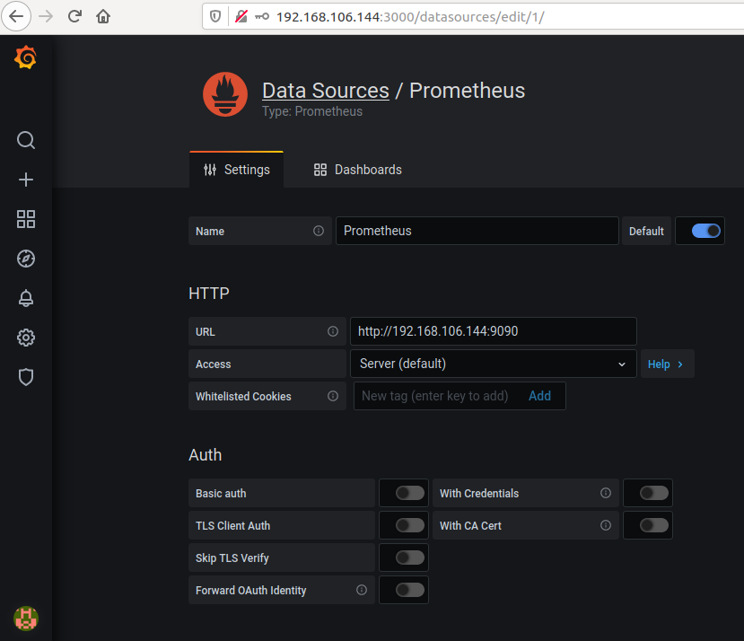

# Prerequisites
1. golang installed - https://golang.org/
2. Docker Installed - https://docs.docker.com/engine/install/ubuntu/

# Setup of Harmony Node
1. Verification of golang Installed
```
user@ubuntu:~$ export PATH=$PATH:/usr/local/go/bin
user@ubuntu:~$ go version
go version go1.16.3 linux/amd64
```
2. Verification of Docker Installed
```
user@ubuntu:~$ docker version
Client: Docker Engine - Community
 Version:           20.10.5
 API version:       1.41
 Go version:        go1.13.15
 Git commit:        55c4c88
 Built:             Tue Mar  2 20:18:05 2021
 OS/Arch:           linux/amd64
 Context:           default
 Experimental:      true
```
3. Compile the Harmony Node for docker
```
user@ubuntu:~$ cd $(go env GOPATH)/src/github.com/harmony-one/harmony
user@ubuntu:~$ make clean
user@ubuntu:~$ docker build -t harmony .
```

4. Start the Docker Container
```
user@ubuntu:~$ docker rm harmony # Remove old docker container
user@ubuntu:~$ docker run --name harmony -it -p "9900:9900" -v "$(go env GOPATH)/src/github.com/harmony-one/harmony:/root/go/src/github.com/harmony-one/harmony" harmony /bin/bash

root@b31643c962bb:~/go/src/github.com/harmony-one/harmony#
```

5. Start the Harmony Node
```
root@b31643c962bb:~/go/src/github.com/harmony-one/harmony# make debug
.
.
Started Explorer server at: 0.0.0.0:5099
Started RPC server at: 127.0.0.1:9599
Started WS server at: 127.0.0.1:9899
Started Rosetta server at: 127.0.0.1:9799
Started Explorer server at: 0.0.0.0:5098
Started RPC server at: 127.0.0.1:9598
Started WS server at: 127.0.0.1:9898
Started Rosetta server at: 127.0.0.1:9798
Started RPC server at: 127.0.0.1:9600
Started RPC server at: 127.0.0.1:9500
Started WS server at: 127.0.0.1:9800
```

6. Curl to check if docker is running correctly
```
user@ubuntu:~$ curl localhost:9090
<a href="/graph">Found</a>.
```

# Setup of Prometheus
7. Download and Unzip Prometheus from https://prometheus.io/download/

8. Change Configuration Settings for Prometheus
```
# my global config
global:
  scrape_interval:     15s # Set the scrape interval to every 15 seconds. Default is every 1 minute.
  evaluation_interval: 15s # Evaluate rules every 15 seconds. The default is every 1 minute.
  # scrape_timeout is set to the global default (10s).

# Alertmanager configuration
alerting:
  alertmanagers:
  - static_configs:
    - targets:
      # - alertmanager:9093

# Load rules once and periodically evaluate them according to the global 'evaluation_interval'.
rule_files:
  # - "first_rules.yml"
  # - "second_rules.yml"

# A scrape configuration containing exactly one endpoint to scrape:
# Here it's Prometheus itself.
scrape_configs:
  # The job name is added as a label `job=<job_name>` to any timeseries scraped from this config.
  - job_name: 'prometheus'

    # metrics_path defaults to '/metrics'
    # scheme defaults to 'http'.

    static_configs:
    - targets: ['localhost:9900']

```

9. Test that the Prometheus site is working
```
Visit localhost:9090
You can enter up in the execute as shown in the picture below
```


# Setup of Grafana
10. Download - https://grafana.com/grafana/download
```
user@ubuntu:~$ sudo apt-get install -y adduser libfontconfig1
user@ubuntu:~$ wget https://dl.grafana.com/oss/release/grafana_7.5.3_amd64.deb
user@ubuntu:~$ sudo dpkg -i grafana_7.5.3_amd64.deb
user@ubuntu:~$ sudo /bin/systemctl daemon-reload
user@ubuntu:~$ sudo /bin/systemctl enable grafana-server
user@ubuntu:~$ sudo /bin/systemctl start grafana-server
```

11. Test that grafana works
```
Browser: localhost:3000
default
username: admin
password: admin
```


12. Add Prometheus as a Data Source


# Setup of Telegram Alerts
13. Search for "chat id echo"


14. Get your ChatID by typing start


15. Search for Botfather on twitter


16. Make a new bot and get the api token


17. Start your bot


18. Enter details into grafana page


19. Send the test Alert


# Setup of Discord Alerts

